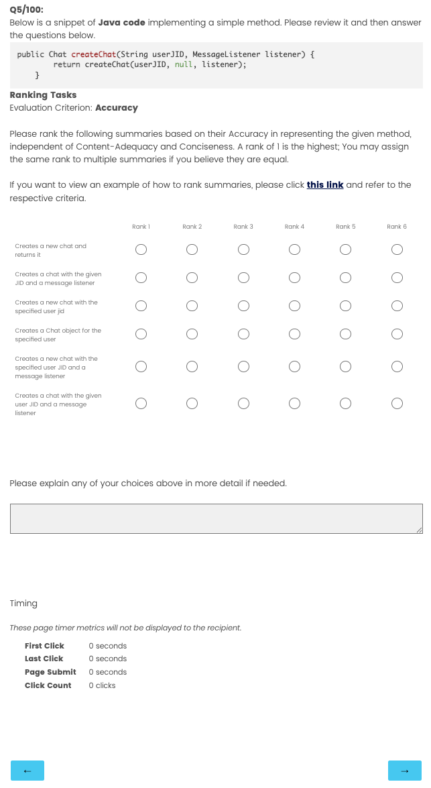

# Enhancing Neural Code Representation with Additional Context

This repository contains the replication package for the paper:

> **"Enhancing Neural Code Representation with Additional Context"**  
> Huy Nguyen, Patanamon Thongtanunam, Christoph Treude  
> *Under revision at ACM Transactions on Software Engineering and Methodology (TOSEM)*  
> Preprint: https://arxiv.org/abs/2510.12082

---

## Data Availability

The full replication package is hosted across two platforms:

- **Figshare** – augmented datasets, human evaluation data, and partial model weights  
  Archive: https://figshare.com/s/71c3233d55c2ad91f30c
- **GitHub** (this repository) – all mining scripts, model training and evaluation scripts, and LLM experiment code  
  Repository: https://github.com/huynxvn/EnhancingCodeRepWithContext

### Figshare archive contents

| Archive / Folder / File | Contents | Format | Size |
|---|---|---|---|
| **`Dataset.zip`** | All augmented datasets (see breakdown below) | `.pkl` / `.jsonl` | **345.47 MB** |
| `clone_detection/` | SeSaMe clone detection — train/dev/test splits with version history, caller/callee, and method age context | `.pkl` | — |
| `classification/` | SeSaMe code classification — train/dev/test splits with version history, caller/callee, and method age context | `.pkl` | — |
| `clone_detection_vh_ablation/` | Clone detection ablation splits varying history depth (1, 3, all versions) — added in response to Reviewer 2 Major Concern 3 (history depth ablation, Section 5.3) | `.pkl` | — |
| `classification_vh_ablation/` | Code classification ablation splits varying history depth (1, 3, all versions) — added in response to Reviewer 2 Major Concern 3 (history depth ablation, Section 5.3) | `.pkl` | — |
| `data/` | CodeSearchNet-Java enriched with version history, call-graph, and method age | `.jsonl` | — |
| `vuln/vul4j_augmented.jsonl` | Vul4J enriched with version history, call-graph, and method age | `.jsonl` | — |
| **`Human_Evaluation.zip`** | Human evaluation data for code summarisation | `.csv` / `.xlsx` | **226.45 kB** |
| **`SourceCode.zip`** | Mining scripts and model training/evaluation code | `.py` / `.sh` | **7.83 MB** |
| **`Model_Weights.zip`** | Partial fine-tuned model weights for selected best-performing configurations | `.bin` / `.pth` / `.safetensors` | **5.27 GB** |

Partial fine-tuned model weights are provided on Figshare for selected configurations. Training from scratch using the scripts and augmented datasets will reproduce all reported results.

### Data placement after download

After downloading `Dataset.zip` from Figshare and unzipping it, place each folder/file as follows:

| Item in `Dataset.zip` | Place at |
|---|---|
| `clone_detection/` | `Classification/data/clone_detection/` |
| `classification/` | `Classification/data/classification/` |
| `clone_detection_vh_ablation/` | `Classification/data/clone_detection_vh_ablation/` |
| `classification_vh_ablation/` | `Classification/data/classification_vh_ablation/` |
| `data/train.jsonl`, `data/valid.jsonl`, `data/test.jsonl` | `Summarization/Task/Code-Summarization/dataset/java/` (copy the files, not the folder) |
| `data/train.jsonl`, `data/valid.jsonl`, `data/test.jsonl` | `LLM/data/data/` (copy again for LLM summarisation experiments) |
| `vuln/vul4j_augmented.jsonl` | `LLM/data/vuln/vul4j_augmented.jsonl` |
| `clone_detection/` | `LLM/data/clone_detection/` (copy again for LLM clone detection experiments) |
| `classification/` | `LLM/data/classification/` (copy again for LLM classification experiments) |

---

## Repository Structure

```
EnhancingCodeRepWithContext/           ← this repository
├── Classification/                    ← DL models (ASTNN, CodeBERT, GraphCodeBERT, CodeT5)
│   ├── mining/
│   │   ├── version_history.py         ← Step 1: mine version history from GitHub
│   │   └── data_merging.py            ← Step 2: post-process and merge version history
│   ├── data_update.py                 ← Step 3: merge call-graph into augmented dataset
│   ├── preprocess_clone.py            ← Step 4a: produce clone-detection .pkl splits
│   ├── preprocess_class.py            ← Step 4b: produce classification .pkl splits
│   ├── prepare_vh_ablation_data.py    ← produce history-depth ablation splits
│   ├── global_config.py               ← shared path configuration
│   ├── tree.py / utils.py             ← shared utilities
│   ├── astnn_*/                       ← ASTNN variants (versionall, callgraph, numofdays, …)
│   ├── transformer_*/                 ← CodeBERT / GraphCodeBERT variants
│   ├── codet5_*/                      ← CodeT5 variants
│   │
│   ├── transformer_shuffled_context_control/   ← Section 6.1: shuffled-context control (transformer)
│   ├── codet5_shuffled_context_control/        ← Section 6.1: shuffled-context control (CodeT5)
│   ├── transformer_projection_control/         ← Section 5.2: projection control experiment
│   ├── transformer_vh_ablation/                ← Section 5.3: history depth ablation
│   ├── codet5_clone_callgraph_v1_dump/         ← Section 5.6: qualitative analysis (call-graph)
│   ├── codet5_clone_qualitative_dump/          ← Section 5.6: qualitative analysis (clone)
│   │
│   ├── experiment_all.sh              ← master script: run all DL experiments
│   ├── experiment_clone.sh            ← run clone-detection experiments only
│   ├── experiment_class.sh            ← run classification experiments only
│   └── experiment.yml                 ← conda environment specification
│
├── Summarization/                     ← Code summarisation models
│   ├── PLBART/                        ← PLBART fine-tuning and evaluation
│   └── Task/Code-Summarization/       ← CodeBERT / GraphCodeBERT / CodeT5 summarisation
│
├── LLM/                               ← LLM experiment code
│   ├── models.py                      ← model registry and configurations
│   ├── script.py                      ← code summarisation: fine-tuning + inference
│   ├── script_clone.py                ← clone detection: fine-tuning + inference
│   ├── script_class.py                ← code classification: fine-tuning + inference
│   ├── script_codesum.py              ← code summarisation (alternate entry point)
│   ├── inference.py                   ← prompt-based inference: summarisation
│   ├── inference_clone.py             ← prompt-based inference: clone detection
│   ├── inference_class.py             ← prompt-based inference: classification
│   ├── inference_vuln.py              ← prompt-based inference: vulnerability detection
│   ├── compute_metrics.py             ← compute BLEU / ROUGE / F1 from output files
│   ├── eval_metrics.py                ← evaluation metric helpers
│   ├── eval_metrics_postproc.py       ← post-processing for LLM outputs
│   └── data/                          ← dataset files for LLM experiments
│       ├── clone_detection/
│       ├── classification/
│       ├── vuln/
│       └── data/                      ← CodeSearchNet-Java (summarisation)
│
├── SURVEY_INSTRUCTION.pdf             ← human evaluation survey instructions
├── LICENSE
└── README.md
```

---

## Environment Setup

### Deep Learning Models (ASTNN, CodeBERT, GraphCodeBERT, CodeT5)

```bash
conda env create -f Classification/experiment.yml
conda activate experiment
```

Key dependencies: Python 3.9, PyTorch 2.1.0 (CUDA 12.1), Transformers 4.38.2, javalang 0.13.0.

### LLM Experiments (CodeLlama, DeepSeek, Qwen)

```bash
pip install torch transformers peft bitsandbytes accelerate wandb
```

The LLM scripts use 4-bit / 8-bit quantisation via `bitsandbytes` and optional LoRA fine-tuning via `peft`. See [`LLM/README.md`](LLM/README.md) for full LLM usage instructions.

---

## Context Mining Pipeline

The augmented datasets are already provided on Figshare (https://figshare.com/s/71c3233d55c2ad91f30c). Follow these steps only if you need to re-mine context from scratch or extend to new repositories.

### Prerequisites

- Clone all SeSaMe / CodeSearchNet source repositories locally (see dataset documentation for the repository list)
- Install [Java-CallGraph](https://github.com/gousiosg/java-callgraph) for call-graph extraction
- Install Lizard for static analysis filtering: `pip install lizard`
- Install PyDriller for Git traversal: `pip install pydriller`
- Install remaining dependencies: `pip install pandas gitpython`

### Step 1 – Mine version history

Edit the path constants at the bottom of `Classification/mining/version_history.py` to point to your local repository clones:

```python
SOURCE_DATA_PATH = 'sesame/src/'        # path to SeSaMe CSV
REPOS_DIR        = 'sesame/src/repos'   # path to cloned repositories
OUTPUT_DIR       = 'mining/output/'
```

Then run:

```bash
python Classification/mining/version_history.py
# Output: mining/output/version_history_mining.json
```

This script traverses each repository's Git history using PyDriller, extracts all historical versions of each method, applies Lizard static analysis to filter out non-meaningful commits (whitespace-only or comment-only changes), and records commit metadata (SHA, date, author).

Historical versions are ordered most-recent-first, and truncation is applied to fit within the model's 512-token budget.

### Step 2 – Post-process and merge version history

```bash
python Classification/mining/data_merging.py
# Output: mining/output/version_history.json
```

This computes `number_of_versions` and `days_to_exist` (method age in days, normalised before being passed to the model) for each method, and produces the merged JSON ready for the next step.

### Step 3 – Extract call-graph context

Run Java-CallGraph on each project's compiled `.jar` to extract caller/callee relationships:

```bash
java -jar javacg-0.1-SNAPSHOT-static.jar <project>.jar > callgraph_output.txt
```

The output format is one edge per line:

```
M:ClassName:methodName(ParamType) C:CalledClass:calledMethod(ParamType)
```

The extracted call-graph is then merged with the version history JSON using `Classification/data_update.py` to produce the final augmented dataset:

```bash
python Classification/data_update.py
# Output: data/SeSaMe_VersionHistory_Callgraph.v7.json
```

**Note on Vul4J mining:** The version history and call-graph mining scripts target SeSaMe and CodeSearchNet-Java repositories. For Vul4J, vulnerability metadata and context are extracted separately during the LLM data preparation stage. See [`LLM/README.md`](LLM/README.md) for details.

### Step 4 – Preprocess for experiments

```bash
python Classification/preprocess_clone.py   # produces data/clone_detection/ splits
python Classification/preprocess_class.py   # produces data/classification/ splits
```

---

## Running Deep Learning Experiments

All DL experiments are in `Classification/` and follow the same naming convention:

```
<model_family>_<context_combination>/<task>_<aggregation>.py
```

Where:
- **model family**: `transformer` (CodeBERT, GraphCodeBERT), `codet5` (CodeT5), `plbart` (PLBART — summarisation only, see [Running Summarisation Experiments](#running-summarisation-experiments)), `astnn`
- **context combination**: `versionall`, `callgraph`, `versionall_callgraph`, `versionall_callgraph_numofdays`, etc.
- **task**: `clone` (clone detection), `class` (code classification)
- **aggregation**: `pure_code` (baseline), `concat`, `max_pool`, `diff_concat`

### Example commands

```bash
cd Classification/

# CodeBERT + version history + call graph + method age, concatenation, clone detection
python -u transformer_versionall_callgraph_numofdays/clone_concat.py --model codebert

# CodeT5 + version history only, max-pooling, code classification
python -u codet5_versionall/class_max_pool.py --model codet5base

# ASTNN + all context, diff-concat, clone detection
python -u astnn_versionall_callgraph_numofdays/clone_diff_concat.py

# Run all experiments (CodeBERT shown; uncomment other models in the script)
bash experiment_all.sh > log.txt
```

Supported `--model` values: `codebert`, `graphcodebert` (transformer family); `codet5base` (codet5 family); `plbart` (summarisation only).

Results are written to `result.txt`; training logs to `log.txt`.

---

## Running Control and Ablation Experiments

### Shuffled-context control (Section 6.1)

Verifies that performance gains come from meaningful context rather than extra tokens.

```bash
cd Classification/

# Transformer models (CodeBERT, GraphCodeBERT)
bash transformer_shuffled_context_control/run_all.sh

# CodeT5
bash codet5_shuffled_context_control/run_all.sh
```

Results are saved to `results_shuffled_control.json` in each folder.

### Projection control (Section 5.2)

Tests whether a simple linear projection of context (without attention) explains the gains.

```bash
cd Classification/
bash transformer_projection_control/run_all.sh
# or separately:
bash transformer_projection_control/run_all_clone.sh
bash transformer_projection_control/run_all_class.sh
```

Results: `results_projection-codebert.json`, `results_projection-graphcodebert.json`.

### History depth ablation (Section 5.3)

Varies the number of historical versions (1 to full history) to study how depth affects performance.

```bash
cd Classification/
bash transformer_vh_ablation/run_vh_ablation.sh
```

Uses data splits in `data/clone_detection_vh_ablation/` and `data/classification_vh_ablation/` (generated by `prepare_vh_ablation_data.py`).

### Qualitative analysis – call-graph (Section 5.6)

Dumps per-pair predictions with call-graph context for manual inspection.

```bash
cd Classification/
bash codet5_clone_callgraph_v1_dump/run_all.sh
python codet5_clone_callgraph_v1_dump/merge_predictions.py
```

### Qualitative analysis – clone (Section 5.6)

Dumps per-pair predictions (with and without context) for the qualitative clone study.

```bash
cd Classification/
bash codet5_clone_qualitative_dump/run_all.sh
python codet5_clone_qualitative_dump/merge_predictions.py
```

---

## Running LLM Experiments

See [`LLM/README.md`](LLM/README.md) for the complete guide. Quick reference:

```bash
cd LLM/

# Fine-tune for code summarisation
python script.py --model deepseek-coder-6.7b-instruct --bits 4 \
    --data_file data --mode train --use_lora --exp code_vh_cg_nod

# Prompt-based inference for clone detection
python inference_clone.py --model codellama-7b-instruct --bits 4 \
    --data_file data/clone_detection/test.pkl --exp code_vh_cg_nod

# Evaluate metrics
python compute_metrics.py --output_dir output/
```

---

## Running Summarisation Experiments

Summarisation experiments are in `Summarization/`. Use the respective model folder (`CodeBERT`, `GraphCodeBERT`, `CodeT5`, `PLBART`) inside `Summarization/Task/Code-Summarization/`.

For example, to replicate **CodeT5** results across all context combinations:

```bash
cd Summarization/Task/Code-Summarization/codet5

# Baseline (source code only)
bash ./run_exp.sh java baseline

# Code + Version History
bash ./run_exp.sh java code_vh

# Code + Call Graph
bash ./run_exp.sh java code_cg

# Code + Version History + Method Age
bash ./run_exp.sh java code_vh_nod

# Code + Version History + Call Graph
bash ./run_exp.sh java code_vh_cg

# Code + Call Graph + Version History
bash ./run_exp.sh java code_cg_vh

# Code + Version History + Call Graph + Method Age
bash ./run_exp.sh java code_vh_cg_nod

# Code + Call Graph + Version History + Method Age
bash ./run_exp.sh java code_cg_vh_nod
```

Replace `codet5` with `codebert`, `graphcodebert`, or `plbart` to run the same variants for other models.

For PLBART specifically:

```bash
cd Summarization/PLBART/
bash scripts/run_summarization.sh
```

---

## Datasets

| Dataset | Task | Source | Augmented format |
|---|---|---|---|
| SeSaMe | Clone detection, Code classification | [Kamp et al., 2019](https://github.com/sesame-dataset) | `.pkl` (train/dev/test) |
| CodeSearchNet-Java | Code summarisation | [Husain et al., 2019](https://github.com/github/CodeSearchNet) | `.jsonl` |
| Vul4J | Vulnerability detection | [Bui et al., 2022](https://github.com/buiducnhat/Vul4J) | `.jsonl` |

Each record in the augmented dataset includes the original source code plus:
- `version_history`: list of historical method versions (most-recent-first, filtered by Lizard)
- `calling` / `called`: caller and callee method source code
- `number_of_days` (normalised): method age in days

---

## Model Weights

Partial fine-tuned model weights are provided on Figshare inside `Model_Weights.zip`. These cover the best-performing configuration for each task. Download and unzip to obtain the following structure:

```
Model_Weights/
├── clone_detection/
│   ├── graphcodebert_code_vh/              ← GraphCodeBERT + version history (F1 = 0.8718)
│   │   ├── clone_pure_code.pth             ← baseline (code only)
│   │   ├── clone_concat.pth                ← concatenation aggregation
│   │   ├── clone_max_pool.pth              ← max-pooling aggregation (best)
│   │   └── clone_diff_concat.pth           ← diff-concat aggregation
│   └── qwen25-coder-14b-code_vh_cg_nod-4bit/   ← Qwen2.5-Coder-14B LoRA adapter (F1 = 0.8889)
│       ├── adapter/
│       │   ├── adapter_model.safetensors   ← LoRA fine-tuned weights
│       │   └── adapter_config.json         ← LoRA configuration
│       ├── adapter_model.safetensors       ← merged adapter weights
│       ├── adapter_config.json
│       ├── tokenizer_config.json / tokenizer.json / merges.txt
│       ├── test_predictions.jsonl          ← model predictions on test set
│       └── test_metrics.json               ← evaluation metrics
│
├── classification/
│   └── codellama-34b-instruct-code_vh_cg_nod-4bit/   ← CodeLlama-34B LoRA adapter (Macro-F1 = 0.8319)
│       ├── adapter/
│       │   ├── adapter_model.safetensors   ← LoRA fine-tuned weights
│       │   └── adapter_config.json
│       ├── adapter_model.safetensors
│       ├── adapter_config.json
│       ├── tokenizer_config.json / tokenizer.json / tokenizer.model
│       ├── test_predictions.jsonl
│       └── test_metrics.json
│
└── code_summarisation/
    └── codet5_code_vh_nod/                 ← CodeT5 + version history + method age (BLEU-4 = 21.18)
        ├── checkpoint-best-bleu/
        │   └── pytorch_model.bin           ← best BLEU-4 checkpoint (recommended)
        ├── checkpoint-best-ppl/
        │   └── pytorch_model.bin           ← best perplexity checkpoint
        ├── checkpoint-last/
        │   └── pytorch_model.bin           ← last training checkpoint
        ├── prediction/                     ← test set predictions and gold references
        ├── training_result.csv             ← per-epoch training metrics
        └── summary.log                     ← training log
```

### Loading GraphCodeBERT weights (clone detection)

The `.pth` files are standard PyTorch state dictionaries. Load using the same model class as in `Classification/transformer_versionall/clone_max_pool.py`:

```python
import torch
model.load_state_dict(torch.load('clone_max_pool.pth'))
```

### Loading LLM LoRA adapter weights (Qwen-14B and CodeLlama-34B)

> **Note:** The base model weights are **not** included in this archive. Only the LoRA adapter weights are provided (~100--200 MB), which is the standard practice for sharing fine-tuned LLMs. The base models (CodeLlama-34B-Instruct and Qwen2.5-Coder-14B-Instruct) are publicly available on HuggingFace and must be downloaded separately. To reproduce our results, download the base model, load the LoRA adapter on top using the `peft` library as shown below, then run inference using the scripts in `LLM/`.

```python
from transformers import AutoModelForCausalLM, AutoTokenizer, BitsAndBytesConfig
from peft import PeftModel
import torch

# 1. Load the base model in 4-bit quantisation
bnb_config = BitsAndBytesConfig(load_in_4bit=True, bnb_4bit_compute_dtype=torch.float16)

# For Qwen-14B clone detection:
base_model = AutoModelForCausalLM.from_pretrained(
    "Qwen/Qwen2.5-Coder-14B-Instruct",
    quantization_config=bnb_config,
    device_map="auto"
)

# 2. Load the LoRA adapter on top
model = PeftModel.from_pretrained(base_model, "Model_Weights/clone_detection/qwen25-coder-14b-code_vh_cg_nod-4bit/adapter")
tokenizer = AutoTokenizer.from_pretrained("Model_Weights/clone_detection/qwen25-coder-14b-code_vh_cg_nod-4bit")

# For CodeLlama-34B classification, replace base model with:
# "meta-llama/CodeLlama-34b-Instruct-hf"
# and adapter path with:
# "Model_Weights/classification/codellama-34b-instruct-code_vh_cg_nod-4bit/adapter"
```

### Loading CodeT5 weights (code summarisation)

```python
from transformers import T5ForConditionalGeneration, RobertaTokenizer

model = T5ForConditionalGeneration.from_pretrained("Salesforce/codet5-base")
model.load_state_dict(torch.load("Model_Weights/code_summarisation/codet5_code_vh_nod/checkpoint-best-bleu/pytorch_model.bin"))
tokenizer = RobertaTokenizer.from_pretrained("Salesforce/codet5-base")
```

---

## Human Evaluation

The human evaluation study for code summarisation involved annotators rating generated summaries using a rank-order-with-ties design in Qualtrics.

The data is available on Figshare (https://figshare.com/s/71c3233d55c2ad91f30c — download and unzip `human_evaluation.zip`):

```
human_evaluation/
├── Pilot Study/       ← pilot phase annotation data
├── Main Study/        ← main study annotation data
└── SURVEY_INSTRUCTION.pdf   ← evaluation guidelines for annotators
```

`SURVEY_INSTRUCTION.pdf` is also downloadable directly from this repository.



---

## Citation

If you use this replication package, please cite:

```bibtex
@article{nguyen2025enhancing,
  title     = {Enhancing Neural Code Representation with Additional Context},
  author    = {Nguyen, Huy and Thongtanunam, Patanamon and Treude, Christoph},
  journal   = {ACM Transactions on Software Engineering and Methodology},
  year      = {2025}
}
```

A preprint is available on arXiv:

```bibtex
@misc{nguyen2025enhancingneuralcoderep,
  title         = {Enhancing Neural Code Representation With Additional Context},
  author        = {Nguyen, Huy and Treude, Christoph and Thongtanunam, Patanamon},
  year          = {2025},
  month         = oct,
  eprint        = {2510.12082},
  archivePrefix = {arXiv},
  primaryClass  = {cs.SE},
  url           = {https://arxiv.org/abs/2510.12082}
}
```
