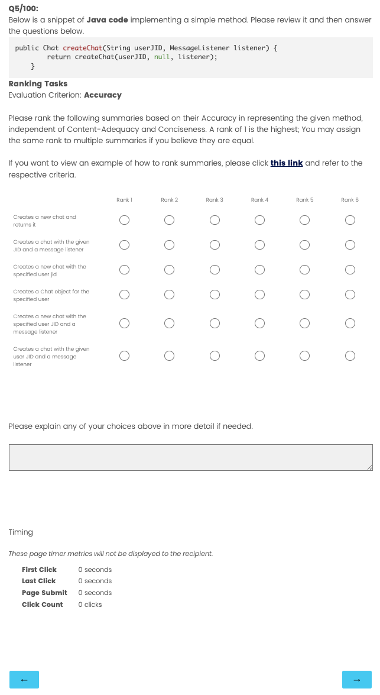

## Enhancing Code Representation With Additional Context

This repository contains the data and code for the journal paper "Enhancing Code Representation With Additional Context"

### Data 

Our data is published using Figshare, please download data from [here](https://figshare.com/s/71c3233d55c2ad91f30c) and put it into the folder data before running experiments.

### Replicating results in the Paper

To replicate results of our RQ1, please use the following command:

- Code Clone Detection

- Code Classification

- Code Summarisation

To replicate results of our RQ2, please use the following command:

- Code Clone Detection

- Code Classification

- Code Summarisation

To replicate results of our RQ3, please use the following command:

- Code Clone Detection

- Code Classification

- Code Summarisation

### Supplementary Materials

#### Human Evaluation Data

- Human Evaluation result on Automated Code Summarisation:
    - Pilot phases (in human_evaluation.zip): `human_evaluation/Pilot Study/`
        
    - Main Study:  (in human_evaluation.zip): `human_evaluation/Main Study/`

    - Example:
    
    <!-- ```
    Below is a snippet of Java code implementing a simple method. Please review it and then answer the
    questions below.

        public Chat createChat(String userJID, MessageListener listener) {
            return createChat(userJID, null, listener);
        }
    
    Ranking Tasks

    Evaluation Criterion: Accuracy
    Please rank the following summaries based on their Accuracy in representing the given method, independent
    of Content-Adequacy and Conciseness. A rank of 1 is the highest; You may assign the same rank to multiple
    summaries if you believe they are equal.
    If you want to view an example of how to rank summaries, please click this link and refer to the respective
    criteria.

    a. Creates a new chat and returns it
    b. Creates a chat with the given JID and a message listener
    c. Creates a new chat with the specified user jid
    d. Creates a Chat object for the specified user
    e. Creates a new chat with the specified user JID and a message listener
    f. Creates a chat with the given user JID and a message listener
    ``` -->
    
## Citations

Please cite the following article if you find our research including findings, datasets and tools to be useful:

```
@misc{nguyen2025enhancingneuralcoderep,
      title={Enhancing Neural Code Representation With Additional Context}, 
      author={Nguyen, Huy and Treude, Christoph and Thongtanunam, Patanamon},
      year={2025},
      month=oct
      eprint={xxxx.xxxxx},
      archivePrefix={arXiv},
      primaryClass={cs.SE},
      url={https://arxiv.org/abs/xxxx.xxxxx}, 
}
```